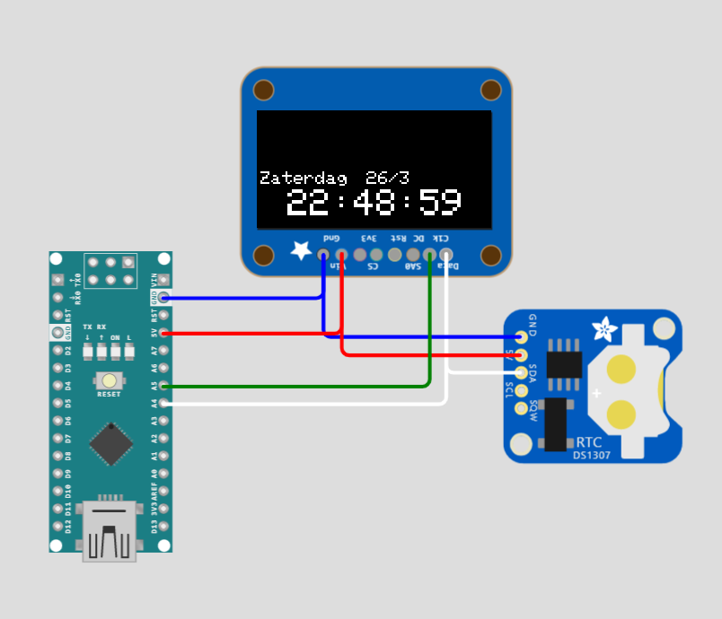

# Intructies voor de Arduino Klok Coder Dojo
## Code en Simulatie
### Test het project uit in de wokwi simulator:
https://wokwi.com/projects/326872404161725010
- Speel een beetje met bedrading en mogelijks met code.
- Test het instellen van de clock uit door de rtc.adjust lijn naar keuze te activeren. bvb: `// rtc.adjust(DateTime(2022, 3, 22, 23, 37, 0));`
- Probeer eens de dag weg te laten
- Probeer eens de dag onder te tijd te zetten

## Echte Arduino
Nu we gezien hebben hoe de code werkt en de bedrading hebben kunnen inspecteren in een virtuele omgeving, gaan we de arduino installatie in het echt doen.

### Adruino bedrading.
Sluit de bedrading aan zoals het ook in de WokWi simulator is aangesloten.

Of je kan je ook baseren op deze foto:\

**Opgelet: Laat je bedrading altijd eerst nog door een begeleider nakijken!** Zo voorkom je kapotte onderdelen.

### Arduino IDE instellen
Als eerste stap moeten we de juiste bibliotheken inladen in de Arduino IDE. Volg daar voor de gifs hieronder:
#### LCD Scherm en klok libraries

#### Arduino Nano Every Installatie


### Code naar echte Arduino shrijven
Nu de arduino ide de juiste onderdelen ingeladen heeft kunnen we verder gaan met de code in te laden en dan naar de arduino te schrijven. 
Hieronder de stappen.
#### Code kopieren
- Creer een nieuw bestand via File -> New.
- Kopieer de code van uit het (wokwi simulator project)[https://wokwi.com/projects/326872404161725010] (of van [hier](../src/rtc_ssd1306_clock.ino)) naar da arduino IDE.
- Vervang alle code in het bestand met de gekopieerde code.
### Arduino aansluiten.
Nu is bijna alles klaar om de code te installeren, maar om dat te doen moeten we natuurlijk wel de Arduino nog aansluiten op de computer via usb.
Doe dit **nadat een begeleider de bedrading nagekeken heeft**

### Com poort selecteren en Code Wegschrijven
Nu moet je nog de juiste com poort selecteren en de code wegschrijven volg daarvoor de onderstaande Gif. Tips:
- Het nummer van de COM poort kan bij idereen anders zijn, selecteer de Com-poort met tussen haakjes `Arduino Nano Every`)
- Je moet daar na op het pijltje klikken.


### Tijd corrigeren.
Het zal je waarshijnlijk opvallen dat de klok nog niet juist staat. Om dat op te lossen moeten we hetvolgende doen:
- Verander in de code 
  ``` 
  // rtc.adjust(DateTime(F(__DATE__), F(__TIME__)));
  ```
  naar 
  ``` 
  rtc.adjust(DateTime(F(__DATE__), F(__TIME__)));
  ```
- Deploy de code (klik op het pijltje in de IDE linksboven)
- Verander de code terug, dus:

  ``` 
  rtc.adjust(DateTime(F(__DATE__), F(__TIME__)));
  ```
  terug naar 
  ``` 
  // rtc.adjust(DateTime(F(__DATE__), F(__TIME__)));
  ```
  - Deploy de code opnieuw(klik op het pijltje in de IDE linksboven)

## Knutselwerk
Nu de arduino werkt, kunnen we de alles nog ineens steken in een zelf-gelasercutte omhulling!
